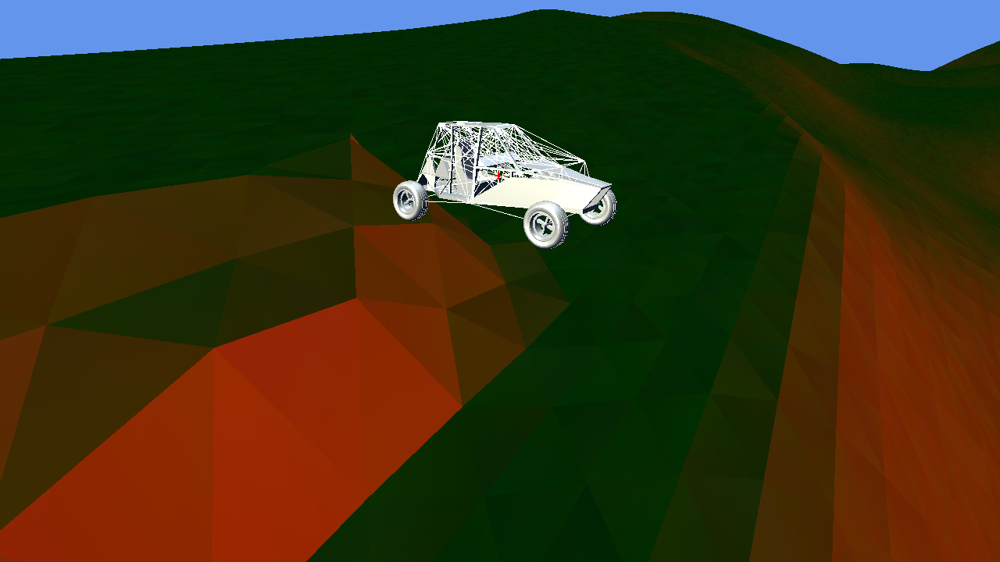
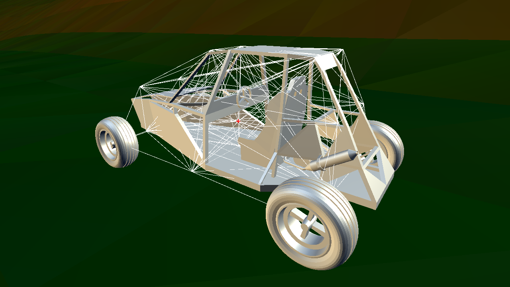

# Car_Physics

__Project creation date:__ 19.03.2017

## Description
This project is a test for self written physics. For testing the physics a car was made with individually simulated wheels.\
The simulation can be slowed down by up to 100 times.

## Technologies
* C#
* MonoGame

## Remarks
The physics have many bugs and are not really realistic. This applies mostly to the traction of the wheels

## Pictures

